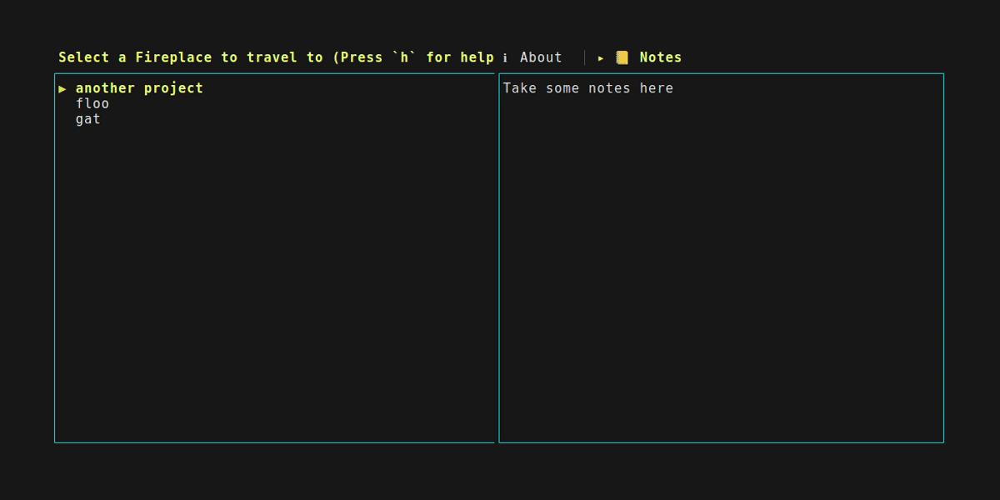
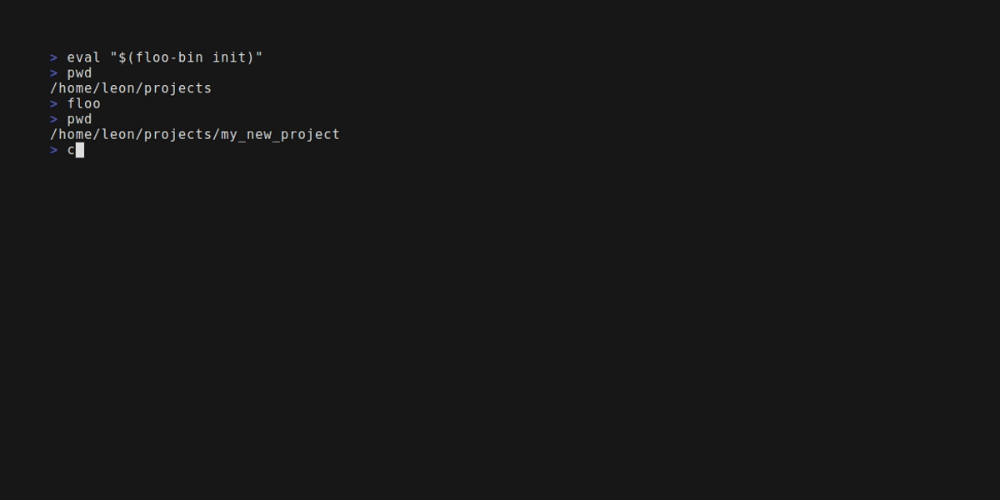

# floo

<p align="center">
  <br/>
  
  
</p>

## What is floo

Inspired by the concept of the floo network of a popular fantasy franchise,
**floo** provides you with a central interface to quickly travel between
workspaces and projects, relieving you of tedious manual navigation and setup of
environments in your terminal.

## How it works

At its core, **floo** allows you to dynamically add and remove fireplaces
from your network. A fireplace has a name and a directory it is connected to.
Via the tui of **floo** you can select a fireplace to travel to, upon which
**floo** transports you right to that workspace, bringing your terminal into
the exact state you need it in for that project. This means **floo** can
set environment variables, open tmux sessions, editors, browsers, you name it,
whatever you needed to manually do to get going on a project, **floo** can take
care of for you. 
Per default, upon selecting a fireplace, **floo** acts as if you were to perform
the following actions manually in your terminal:
1. Close **floo**
2. cd into the directory of the fireplace
3. source any .env or .envrc files

The default actions can be overriden on a per fireplace basis
by placing a `.floo` script in the directory to which your fireplace points.
For more information read our [quickstart](https://keyvizsla.github.io/floo/guide/quickstart.html) guide.

## Examples


*Basic usage example of floo, we create a new fireplace which we then use to quicktravel into that directory, any .env or .envrc files of that directory are sources as well.*


*More advanced usage example, we use a predefined template to define custom floo actions, to let floo know to start a tmux session with two windows when travelling to the fireplace.*


*For convenience, floo allows you to also track notes for each fireplace, this supports markdown and can help you track where you left off or whatever else you want to remember.*

## Installing the latest stable version

Currently the preferred way of installing floo is through [cargo](https://doc.rust-lang.org/cargo/getting-started/installation.html) (`cargo install floo`).
Afterwards, add the following to your shell's rc file (.bashrc/.zshrc):
```sh
eval "$(floo-bin init)"
```
And restart your terminal.

*Note: We are planning to release to other package managers in the future once floo becomes more stable.*

## Resources

You can find all relevant information about floo including a detailed usage manual in 
[the official documentation](https://keyvizsla.github.io/floo/index.html)

## Known Limitations

- `floo` currently is only expected to work on linux and mac systems.
- `floo` is expected not to work correctly with any shells other than `bash` and `zsh`.
- When applying a template, it is applied regardless whether or not the user has saved their modifications to the template. That is, if they just quit the editor without saving, the default template is applied, whereas it would be preferrable to instead not apply anything at all. If this happens to you and you did not intend to apply the template, simply run `rm .floo` in the fireplace's directory.

## Contributing

Thanks for being interested in becoming involved in the development and improvement of `floo`.
Check out our [contributing guide](https://keyvizsla.github.io/floo/guide/contributing.html) and see how you can help.
