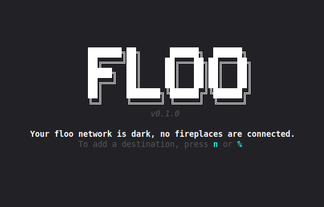
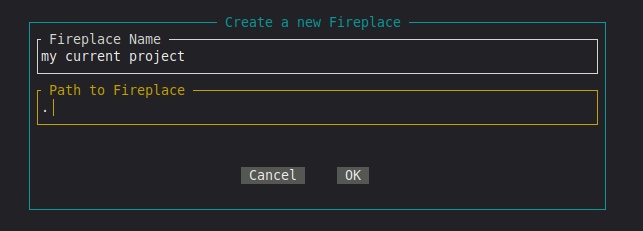

# Quickstart

Having installed **floo** on your system, you are now ready to build your floo network.
In **floo** you are able to define fireplaces. Fireplaces equate to projects or workspaces
to which you want to be able to travel to and from quickly, with optional additional configurations
about what state you want your shell to be brought to once you reach your destination.

## Basic setup

When you first run `floo` in your terminal, you should see this screen:


As prompted, you can now get started setting up your first fireplace by pressing one of `n` or `%`.
Most of the keybinds in **floo** should feel natural to you if you have been working with other
TUI applications, you are however always welcome to provide alternative suggestions as an issue.



Using `tab` or your arrow keys, navigate through the dialog, filling in the blanks, to create your
first fireplace. For the path to the fireplace, you should put the path to the root directory
of your project, for example for projects using git this would be the directory containing the .git
directory.
For your convenience, **floo** supports relative paths to where it is currently being executed,
that means if you ran `floo` from the root of the directory in which you want to have a fireplace,
you can just put `.` as path to fireplace. On future executions, **floo** will correctly resolve
the path regardless of which directory you call **floo** from.
Alternatively, if you already are in the directory where you want to create a fireplace,
you can also run `floo create` which will start floo with a prefilled fireplace creation dialog,
so you don't have to manually insert your path.

You have now successfully created your first fireplace and are all set to travel.

## Defining custom actions

You can define the specific actions that `floo` should take to transport you to a selected fireplace,
by placing a `.floo` file in the corresponding directory of that fireplace.
This script should be a script that your shell can source, upon which it will then be in the state
that floo will later also bring the shell into.
If floo cannot find such a script, it will perform its default actions, which correspond to

```sh
cd <fireplace directory>
source .env # or .envrc whichever is available
```

For a gentle introduction, you can for example take a `cargo` project of yours and place
a .floo script at its root that contains the following:

```sh
cd $FLOO_DIR
alias run='cargo run'
```

If you now set up a fireplace in `floo` for this project and select it, your terminal should now be
in that projects root directory and you should be able to call `run` instead of having to type out
`cargo run`. This is of course just a small example of what one could do, the possibilities are limitless.

You may have noticed that we accessed the `FLOO_DIR` variable in this script. `floo` exposes certain
details about the fireplace you are traveling to via environment variables (more on which variables are available in the [templating section](/guide/templates.html) of these docs). In this way, you can avoid
hard-coding things into your scripts. This also facilitates the re-usability of such scripts.
If you were to want the same alias available for other cargo projects, you could just place the
exact same .floo script in those directories and it would work out of the box due to this injection
of environment variables.
When you are at this point that you have found a common workflow that you want in multiple projects,
you might want to consider turning this into a template, which allows `floo` to take care of inserting
the .floo file for you. Check out the [templating section](/guide/templates.html) for that.


## Troubleshooting

We will keep updating this section with common issues users run into and their fixes.
Please help us in improving this documentation by raising an issue where you describe
your troubles.
If you were able to resolve your troubles, even if you think no one else would make that mistake,
we always appreciate PRs updating this troubleshooting guide.
